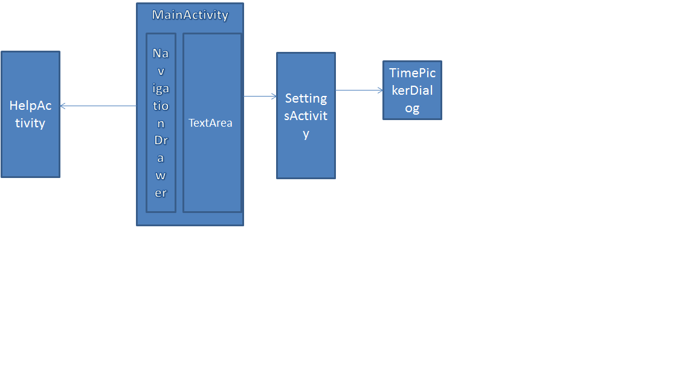

# OneItemADay

OneItemADay app:
-----------------
This app features:
- Random Joke and Word.
- Friendly User-Interface.
- Setting Time-Scheduling Alarm to get a Joke as Notification.
- Share with Friends
- Save to File.
- Help assistance to let users know how to use this App

Whether you're looking to make your friends laugh or you're just looking for a laugh yourself goahead and read the Joke.
These Jokes are meant for age 17 and older.The main advantage of reading a Joke makes you feel Healthy,Stress-less and Happy forever.

Word is very important.We use words to communicate with our family and friends.Learning a word improves your Vocabulary,and
will help you gain Knowledge.

The app is intended to provide you with various different items spanning different areas in the field of entertainment,
education, knowlege etc.  Currently it supports Word and Joke and in future many more items will be added such as 
General Knowledge questions, Random quotes, Random tips etc.

Android Components and Libraries Used:
-------------------------------------
- Activities !!!
- Intents !!!!
- SerVices
- AlarmManager[System Service]
- Fragments
- NavigationDrawer
- Notification
- FileStorage
- RecyclerView
- DialogFragment
- ViewPager
- SlidingTabLayout
- TimePicker Dialog
- AsyncTask
 

UI Navigation diagram:
---------------------

